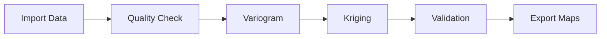

# GeoArchaeo - Advanced Geostatistical Analysis for Archaeological Research

[](https://qgis.org)
[](https://python.org)
[](https://www.gnu.org/licenses/gpl-3.0)
[](https://github.com/enzococca/GeoArchaeo/issues)

**Professional geostatistical system for archaeology** - A complete QGIS plugin for advanced spatial analysis, multivariate kriging, machine learning, and optimal sampling design for archaeological research.

## Key Features

### Geostatistical Analysis
- **Automatic variograms** with anisotropy detection
- **6 Kriging methods**: Ordinary, Universal, Co-Kriging, Regression, Indicator, Spatio-Temporal
- **Automatic cross-validation** (LOO, k-fold)
- **Batch processing** for datasets > 100k points

### Machine Learning
- **Automatic pattern recognition** for archaeological structures
- **Spatial clustering** (K-Means, DBSCAN)
- **Anomaly detection** with Isolation Forest
- **Random Forest** predictions

### GIS Integration
- **Native QGIS Processing Provider**
- **SpatiaLite** data management
- **GeoTIFF export** for publications
- **Interactive charts** with Plotly

### Archaeology-Specific
- **Ceramic analysis** and artifact distribution
- **GPR + Magnetometry fusion**
- **Compositional soil analysis** (CLR/ILR transforms)
- **Optimal sampling design**

## Installation

### Prerequisites

```bash
# Python dependencies
pip install numpy scipy pandas scikit-learn plotly

# SpatiaLite (Ubuntu/Debian)
sudo apt-get install libspatialite-dev spatialite-bin

# SpatiaLite (macOS)
brew install spatialite-tools

# SpatiaLite (Windows)
# Included in OSGeo4W
```

### Method 1: From ZIP (Recommended)

1. Download the latest release: [Download GeoArchaeo.zip](https://github.com/enzococca/GeoArchaeo/releases/latest)
2. In QGIS: `Plugins > Manage and Install Plugins > Install from ZIP`
3. Select the downloaded ZIP file
4. Restart QGIS

### Method 2: From Repository

```bash
# Linux/macOS
cd ~/.local/share/QGIS/QGIS3/profiles/default/python/plugins/
git clone https://github.com/enzococca/GeoArchaeo.git

# Windows
cd %APPDATA%\QGIS\QGIS3\profiles\default\python\plugins\
git clone https://github.com/enzococca/GeoArchaeo.git
```

### Method 3: QGIS Plugin Manager

The plugin is available in the official QGIS Plugin Repository.

## Quick Start

### 1. First Analysis in 5 Minutes

```python
# 1. Open QGIS and activate GeoArchaeo
# 2. Load your point data (CSV, SHP, etc.)
# 3. Click the GeoArchaeo icon in the toolbar
# 4. In the panel:
#    - "Data" tab -> Select layer and field
#    - "Variogram" tab -> Click "Calculate"
#    - "Kriging" tab -> Click "Run"
# 5. Result: a professional interpolated map!
```

### 2. Python Console Example

```python
import processing

# Variogram
result = processing.run("geoarchaeo:variogram", {
    'INPUT': 'path/to/points.shp',
    'FIELD': 'ceramic_count',
    'MAX_DISTANCE': 50,
    'MODEL': 0  # Spherical
})

# Ordinary Kriging
kriging = processing.run("geoarchaeo:ordinarykriging", {
    'INPUT': 'path/to/points.shp',
    'FIELD': 'ceramic_count',
    'PIXEL_SIZE': 2.0,
    'OUTPUT': 'kriging_result.tif'
})
```

## Documentation

### Archaeological Data Format

#### Minimum CSV Format
```csv
id,x,y,type,quantity,period
1,345678.5,4567890.2,ceramic,25,roman
2,345679.1,4567891.7,metal,5,roman
```

**Requirements:**
- Coordinates in a projected CRS (e.g. UTM)
- At least one numeric field for interpolation
- Minimum 30 points for robust analysis

### Typical Workflow



### Use Cases

#### Ceramic Density Analysis
Identify functional areas (kitchens, storage rooms) based on fragment distribution.

#### Geophysical Data Fusion
Combine GPR + Magnetometry to identify buried structures.

#### Compositional Analysis
CLR/ILR transforms for granulometric and chemical soil data.

#### Excavation Optimization
Calculate optimal positions for new test trenches by minimizing uncertainty.

## Sample Datasets

The repository includes sample datasets for testing:

```
test_layers/
├── villa_ceramica.csv        # 500 points - ceramic distribution
├── necropoli.csv             # 120 tombs with attributes
├── geofisica_survey.csv      # Geophysical survey grid
├── soil_samples.csv          # 80 points - compositional analysis
└── ricognizione_survey.csv   # Field survey data
```

## Development

### Project Structure

```
geoarchaeo/
├── __init__.py                 # Entry point
├── geoarchaeo_plugin.py        # Main plugin class
├── processing_provider.py      # Processing algorithms
├── compat.py                   # Qt5/Qt6 compatibility
├── i18n.py                     # Internationalization (IT/EN)
├── core/
│   └── geostat_engine.py       # Geostatistical engine
├── gui/
│   └── main_dock.py            # Dock widget interface
├── icons/                      # Icons and resources
├── doc/                        # Documentation
├── test_layers/                # Sample datasets
└── metadata.txt                # QGIS metadata
```

### Contributing

Contributions are welcome! To contribute:

1. Fork the repository
2. Create a branch (`git checkout -b feature/AmazingFeature`)
3. Commit your changes (`git commit -m 'Add AmazingFeature'`)
4. Push to the branch (`git push origin feature/AmazingFeature`)
5. Open a Pull Request

## Citation

If you use GeoArchaeo in your research, please cite:

```bibtex
@software{geoarchaeo2024,
  author = {Cocca, Enzo},
  title = {GeoArchaeo: Advanced Geostatistical Analysis for Archaeological Research},
  year = {2024},
  publisher = {GitHub},
  url = {https://github.com/enzococca/GeoArchaeo}
}
```

## Support

- **Bug reports**: [Open an issue](https://github.com/enzococca/GeoArchaeo/issues/new)
- **Email**: [enzo.ccc@gmail.com](mailto:enzo.ccc@gmail.com)

## License

This project is licensed under the **GNU General Public License v3.0** - see the [LICENSE](LICENSE) file for details.

## Acknowledgements

- **QGIS Development Team** for the excellent platform
- **Archaeological community** for feedback and testing

## Project Status

- [x] Complete geostatistical core
- [x] Processing integration
- [x] Basic Machine Learning
- [x] Full documentation
- [x] Plugin in official QGIS repository
- [ ] Multilingual GUI (IT/EN/ES/FR)
- [ ] Video tutorials
- [ ] Online workshops

## Useful Links

- **Repository**: [github.com/enzococca/GeoArchaeo](https://github.com/enzococca/GeoArchaeo)
- **Issues**: [Bug Reports](https://github.com/enzococca/GeoArchaeo/issues)
- **QGIS**: [qgis.org](https://qgis.org)

---

<div align="center">

**Developed for the archaeological community by [Enzo Cocca](mailto:enzo.ccc@gmail.com)**

[](https://github.com/enzococca)
[](https://github.com/enzococca/GeoArchaeo)

</div>
