# GeoArchaeo - Advanced Geostatistical Analysis for Archaeological Research

[](https://qgis.org)
[](https://python.org)
[](https://www.gnu.org/licenses/gpl-3.0)
[](https://github.com/enzococca/geoarchaeo/issues)

**Sistema professionale di geostatistica per l'archeologia** - Plugin QGIS completo per analisi spaziale avanzata, kriging multivariabile, machine learning e ottimizzazione campionamenti archeologici.


## 🎯 Features Principali

### 📊 Analisi Geostatistica
- **Variogrammi** automatici con detection anisotropia
- **6 metodi di Kriging**: Ordinary, Universal, Co-Kriging, Regression, Indicator, Spazio-Temporale
- **Cross-validation** automatica (LOO, k-fold)
- **Batch processing** per dataset > 100k punti

### 🤖 Machine Learning
- **Pattern Recognition** automatico per strutture archeologiche
- **Clustering** spaziale (K-Means, DBSCAN)
- **Anomaly Detection** con Isolation Forest
- **Random Forest** per predizioni

### 🗺️ Integrazione GIS
- **Processing Provider** nativo QGIS
- **SpatiaLite** per gestione dati
- **Export GeoTIFF** per pubblicazioni
- **Grafici interattivi** con Plotly

### 🏛️ Specifico per Archeologia
- **Analisi ceramica** e distribuzione reperti
- **Fusione GPR + Magnetometria**
- **Analisi composizionale** terreni (CLR/ILR)
- **Design campionamento** ottimale

## 📦 Installazione

### Prerequisiti

```bash
# Dipendenze Python
pip install numpy scipy pandas scikit-learn plotly

# SpatiaLite (Ubuntu/Debian)
sudo apt-get install libspatialite-dev spatialite-bin

# SpatiaLite (macOS)
brew install spatialite-tools

# SpatiaLite (Windows)
# Incluso in OSGeo4W
```

### Metodo 1: Da ZIP (Raccomandato)

1. Scarica l'ultima release: [Download GeoArchaeo.zip](https://github.com/enzococca/geoarchaeo/releases/latest)
2. In QGIS: `Plugins → Manage and Install Plugins → Install from ZIP`
3. Seleziona il file ZIP scaricato
4. Riavvia QGIS

### Metodo 2: Da Repository

```bash
# Linux/macOS
cd ~/.local/share/QGIS/QGIS3/profiles/default/python/plugins/
git clone https://github.com/enzococca/geoarchaeo.git

# Windows
cd %APPDATA%\QGIS\QGIS3\profiles\default\python\plugins\
git clone https://github.com/enzococca/geoarchaeo.git
```

### Metodo 3: Plugin Manager (Coming Soon)

Il plugin sarà disponibile nel QGIS Plugin Repository ufficiale.

## 🚀 Quick Start

### 1. Prima Analisi in 5 Minuti

```python
# 1. Apri QGIS e attiva GeoArchaeo
# 2. Carica i tuoi dati puntuali (CSV, SHP, etc.)
# 3. Click sull'icona GeoArchaeo nella toolbar
# 4. Nel pannello:
#    - Tab "Dati" → Seleziona layer e campo
#    - Tab "Variogramma" → Click "Calcola"
#    - Tab "Kriging" → Click "Esegui"
# 5. Risultato: mappa interpolata professionale!
```

### 2. Esempio Python Console

```python
import processing

# Variogramma
result = processing.run("geoarchaeo:variogram", {
    'INPUT': 'path/to/points.shp',
    'FIELD': 'ceramica_count',
    'MAX_DISTANCE': 50,
    'MODEL': 0  # Sferico
})

# Ordinary Kriging
kriging = processing.run("geoarchaeo:ordinarykriging", {
    'INPUT': 'path/to/points.shp',
    'FIELD': 'ceramica_count',
    'PIXEL_SIZE': 2.0,
    'OUTPUT': 'kriging_result.tif'
})
```

## 📖 Documentazione

### Struttura Dati Archeologici

#### Formato CSV Minimo
```csv
id,x,y,tipo,quantita,periodo
1,345678.5,4567890.2,ceramica,25,romano
2,345679.1,4567891.7,metallo,5,romano
```

**Requisiti:**
- Coordinate in sistema proiettato (es. UTM)
- Almeno un campo numerico per interpolazione
- Minimo 30 punti per analisi robusta

### Workflow Tipico

```mermaid
graph LR
    A[Import Dati] --> B[Check Qualità]
    B --> C[Variogramma]
    C --> D[Kriging]
    D --> E[Validazione]
    E --> F[Export Mappe]
```



### Casi d'Uso

#### 🏺 Analisi Densità Ceramica
Identifica aree funzionali (cucine, magazzini) basandosi sulla distribuzione dei frammenti.

#### 📡 Fusione Dati Geofisici
Combina GPR + Magnetometria per identificazione strutture sepolte.

#### 🧪 Analisi Composizionale
Trasformazioni CLR/ILR per dati granulometrici e chimici del terreno.

#### 🎯 Ottimizzazione Scavi
Calcola posizioni ottimali per nuovi saggi minimizzando l'incertezza.

## 🖼️ Screenshots

### Interfaccia Principale


### Variogramma Interattivo


### Risultati Kriging


## 📊 Dataset di Esempio

Il repository include dataset di esempio per testing:

```bash
examples/
├── villa_ceramica.csv      # 500 punti densità ceramica
├── necropoli.csv           # 150 tombe con attributi
├── geofisica_grid.csv      # Griglia GPR+MAG 0.5m
└── tutorial_project.qgz    # Progetto QGIS completo
```

## 🛠️ Sviluppo

### Struttura del Progetto

```
geoarchaeo/
├── __init__.py                 # Entry point
├── geoarchaeo_plugin.py        # Plugin principale
├── processing_provider.py      # Algoritmi Processing
├── core/
│   ├── geostat_engine.py      # Motore geostatistico
│   ├── kriging.py             # Implementazioni kriging
│   └── ml_analysis.py         # Machine Learning
├── gui/
│   ├── main_dock.py           # Interfaccia dock
│   └── dialogs/               # Dialoghi custom
├── algorithms/                 # Algoritmi Processing
├── icons/                      # Icone e risorse
├── tests/                      # Unit tests
└── metadata.txt               # Metadata QGIS
```

### Contribuire

Contribuzioni benvenute! Per contribuire:

1. Fork il repository
2. Crea un branch (`git checkout -b feature/AmazingFeature`)
3. Commit le modifiche (`git commit -m 'Add AmazingFeature'`)
4. Push al branch (`git push origin feature/AmazingFeature`)
5. Apri una Pull Request

### Testing

```bash
# Run unit tests
python -m pytest tests/

# Test in QGIS
python tests/test_in_qgis.py
```

## 📝 Pubblicazioni e Citazioni

Se usi GeoArchaeo per ricerca, per favore cita:

```bibtex
@software{geoarchaeo2024,
  author = {Cocca, Enzo},
  title = {GeoArchaeo: Advanced Geostatistical Analysis for Archaeological Research},
  year = {2024},
  publisher = {GitHub},
  url = {https://github.com/enzococca/geoarchaeo}
}
```

### Articoli che usano GeoArchaeo

- *Coming soon*

## 🤝 Supporto

### Documentazione Completa
[Leggi la documentazione completa](docs/DOCUMENTATION.md) (60+ pagine con esempi e tutorial)

### Segnalazione Bug
[Apri una issue](https://github.com/enzococca/geoarchaeo/issues/new) per segnalare problemi

### Domande e Supporto
📧 **Email**: [enzo.ccc@gmail.com](mailto:enzo.ccc@gmail.com)

## 📜 Licenza

Questo progetto è distribuito sotto licenza **GNU General Public License v3.0** - vedi il file [LICENSE](LICENSE) per dettagli.

## 🙏 Ringraziamenti

- **QGIS Development Team** per l'eccellente piattaforma
- **Comunità archeologica** per feedback e testing
- **Contributors** per miglioramenti e correzioni

## 📊 Stato del Progetto

- [x] Core geostatistico completo
- [x] Integrazione Processing
- [x] Machine Learning base
- [x] Documentazione completa
- [ ] Plugin nel repository QGIS ufficiale
- [ ] GUI multilingua (IT/EN/ES/FR)
- [ ] Video tutorial
- [ ] Workshop online

## 🔗 Link Utili

- **Repository**: [github.com/enzococca/geoarchaeo](https://github.com/enzococca/geoarchaeo)
- **Issues**: [Bug Reports](https://github.com/enzococca/geoarchaeo/issues)
- **QGIS**: [qgis.org](https://qgis.org)
- **Python Geostatistics**: [scikit-gstat](https://github.com/mmaelicke/scikit-gstat)

---

<div align="center">
  
**Sviluppato con ❤️ per la comunità archeologica da [Enzo Cocca](mailto:enzo.ccc@gmail.com)**

[](https://github.com/enzococca)
[](https://github.com/enzococca/geoarchaeo)

</div>