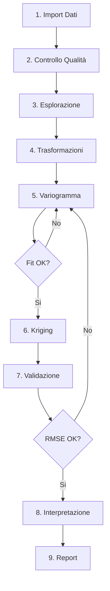

# GeoArchaeo Plugin - Documentazione Completa
## Sistema Avanzato di Geostatistica per l'Archeologia

---

## 📚 Indice

1. [Introduzione](#1-introduzione)
2. [Installazione e Configurazione](#2-installazione-e-configurazione)
3. [Preparazione e Struttura Dati](#3-preparazione-e-struttura-dati)
4. [Interfaccia e Componenti](#4-interfaccia-e-componenti)
5. [Casi d'Uso Archeologici](#5-casi-duso-archeologici)
6. [Tutorial Step-by-Step](#6-tutorial-step-by-step)
7. [Algoritmi e Parametri](#7-algoritmi-e-parametri)
8. [Troubleshooting e FAQ](#8-troubleshooting-e-faq)
9. [Best Practices](#9-best-practices)
10. [Esempi e Dataset](#10-esempi-e-dataset)

---

## 1. Introduzione

### 1.1 Cos'è GeoArchaeo?

GeoArchaeo è un plugin QGIS professionale per l'analisi geostatistica avanzata in archeologia. Integra tecniche di kriging, machine learning e analisi composizionale per:

- **Interpolazione spaziale** di dati archeologici
- **Fusione multi-sensore** di prospezioni geofisiche
- **Pattern recognition** automatico di strutture sepolte
- **Ottimizzazione** delle strategie di scavo
- **Analisi predittiva** per la localizzazione di siti

### 1.2 A chi è rivolto?

- **Archeologi** con progetti di ricerca spaziale
- **Geoarcheologi** per analisi sedimentologiche
- **Responsabili di scavo** per pianificazione ottimale
- **Ricercatori** in archeologia computazionale
- **Soprintendenze** per gestione territoriale

### 1.3 Requisiti di Sistema

| Componente | Minimo | Raccomandato |
|------------|---------|--------------|
| QGIS | 3.16 | 3.28+ |
| Python | 3.7 | 3.9+ |
| RAM | 8 GB | 16 GB |
| Spazio disco | 500 MB | 2 GB |
| OS | Windows 10, Ubuntu 20.04, macOS 10.14 | Ultimi OS |

---

## 2. Installazione e Configurazione

### 2.1 Installazione Dipendenze

#### Windows
```bash
# Apri OSGeo4W Shell come amministratore
python -m pip install --upgrade pip
pip install numpy scipy pandas scikit-learn plotly
pip install rasterio  # opzionale, per export GeoTIFF avanzato
```

#### Linux/Ubuntu
```bash
# Installa SpatiaLite
sudo apt-get update
sudo apt-get install libspatialite-dev spatialite-bin

# Installa dipendenze Python
pip3 install numpy scipy pandas scikit-learn plotly
```

#### macOS
```bash
# Con Homebrew
brew install spatialite-tools
pip3 install numpy scipy pandas scikit-learn plotly
```

### 2.2 Installazione Plugin

#### Metodo 1: Da ZIP
1. Scarica `geoarchaeo.zip` dal repository
2. In QGIS: **Plugins → Manage and Install Plugins → Install from ZIP**
3. Seleziona il file ZIP
4. Riavvia QGIS

#### Metodo 2: Manuale
```bash
# Linux/Mac
cd ~/.local/share/QGIS/QGIS3/profiles/default/python/plugins/
git clone https://github.com/geoarchaeo/plugin geoarchaeo

# Windows
cd %APPDATA%\QGIS\QGIS3\profiles\default\python\plugins\
git clone https://github.com/geoarchaeo/plugin geoarchaeo
```

### 2.3 Prima Configurazione

1. **Attiva il plugin**: Plugins → Manage → ✓ GeoArchaeo
2. **Verifica installazione**: dovrebbe apparire toolbar e dock
3. **Test rapido**: 
   - Carica dati di esempio
   - Click su icona GeoArchaeo
   - Se il pannello si apre, installazione OK

### 2.4 Configurazione Database SpatiaLite

```python
# Test SpatiaLite in QGIS Python Console
import sqlite3
conn = sqlite3.connect(':memory:')
conn.enable_load_extension(True)

# Prova a caricare spatialite
try:
    conn.load_extension('mod_spatialite')
    print("✓ SpatiaLite funzionante")
except:
    print("✗ SpatiaLite non trovato - alcune funzioni saranno limitate")
```

---

## 3. Preparazione e Struttura Dati

### 3.1 Formati Dati Supportati

| Tipo Dato | Formati | Note |
|-----------|---------|------|
| Vettoriali punti | SHP, GPKG, CSV, GeoJSON | Coordinate proiettate (no lat/lon) |
| Vettoriali poligoni | SHP, GPKG | Per boundaries e aree scavo |
| Raster | GeoTIFF, ASC, IMG | DEM, geofisica griglia |
| Database | SpatiaLite, PostGIS | Per progetti grandi |
| Tabellari | CSV, XLSX | Con colonne X, Y |

### 3.2 Struttura Dati Archeologici

#### 3.2.1 Tabella Reperti (minima)
```csv
id,x,y,tipo,materiale,periodo,quantita,peso_g,us
1,345678.5,4567890.2,ceramica,terracotta,romano,5,120.5,101
2,345679.1,4567891.7,metallo,bronzo,romano,1,45.2,101
3,345680.3,4567889.5,ceramica,sigillata,romano,3,67.8,102
```

**Campi obbligatori:**
- `x`, `y`: coordinate nel sistema proiettato
- Un campo valore numerico per interpolazione

**Campi raccomandati:**
- `id`: identificatore univoco
- `tipo`: classificazione reperto
- `us`: unità stratigrafica
- `periodo`: fase cronologica
- `quantita`: per analisi densità

#### 3.2.2 Tabella Prospezioni Geofisiche
```csv
id,x,y,gpr_amplitude,mag_nt,res_ohm,depth_m,line_id
1,345670.0,4567880.0,125.3,48950.2,35.6,0.5,L001
2,345670.5,4567880.0,118.7,48948.5,34.2,0.5,L001
3,345671.0,4567880.0,132.1,48952.1,38.9,0.5,L001
```

**Best practices:**
- Griglia regolare per geofisica (0.5m o 1m)
- Normalizzare unità di misura
- Includere `line_id` per processing per linea

#### 3.2.3 Tabella Campioni Geoarcheologici
```csv
sample_id,x,y,depth_cm,ph,p_ppm,organic_percent,sand,silt,clay
GA001,345675.5,4567885.3,20,7.2,125,3.5,45,35,20
GA002,345680.5,4567885.3,20,7.5,189,4.2,40,38,22
GA003,345685.5,4567885.3,20,7.1,156,3.8,42,36,22
```

**Note composizionali:**
- `sand + silt + clay = 100%` (dato composizionale)
- Richiede trasformazione CLR/ILR prima di kriging

### 3.3 Sistemi di Coordinate

#### CRS Raccomandati per Italia

| Zona | EPSG | Nome | Uso |
|------|------|------|-----|
| Nord Italia | 32632 | WGS84 UTM 32N | Generale |
| Centro Italia | 32633 | WGS84 UTM 33N | Generale |
| Italia peninsulare | 3003 | Monte Mario Italy 1 | Catastale |
| Italia con Sicilia | 3004 | Monte Mario Italy 2 | Catastale |
| Locale alta precisione | 6706 | RDN2008 UTM 32N | GPS/GNSS |

**⚠️ IMPORTANTE**: 
- **MAI** usare WGS84 lat/lon (EPSG:4326) per analisi spaziali
- Sempre coordinate **proiettate** in metri
- Verificare unità: `Project → Properties → General → Units`

### 3.4 Controlli Qualità Dati

#### Check-list Pre-Analisi

- [ ] **Coordinate nel CRS corretto**
  ```python
  # In QGIS Python Console
  layer = iface.activeLayer()
  print(f"CRS: {layer.crs().authid()}")
  print(f"Unità: {layer.crs().mapUnits()}")
  ```

- [ ] **No duplicati spaziali**
  ```sql
  -- In DB Manager
  SELECT x, y, COUNT(*) as n
  FROM reperti
  GROUP BY x, y
  HAVING COUNT(*) > 1;
  ```

- [ ] **Valori anomali (outliers)**
  ```python
  # Trova outliers con z-score > 3
  import numpy as np
  values = [f['quantita'] for f in layer.getFeatures()]
  z_scores = np.abs((values - np.mean(values)) / np.std(values))
  outliers = np.where(z_scores > 3)[0]
  print(f"Trovati {len(outliers)} outliers")
  ```

- [ ] **Completezza dati**
  ```python
  # Check valori NULL
  null_count = sum(1 for f in layer.getFeatures() if f['valore'] is None)
  print(f"Record con valori NULL: {null_count}")
  ```

### 3.5 Preparazione Dati Multi-Sensore

Per co-kriging di GPR + Magnetometria:

1. **Allineamento spaziale**: stesso grid o buffer tolerance
2. **Normalizzazione scale**: 
   ```python
   # Normalizza 0-1
   gpr_norm = (gpr - gpr.min()) / (gpr.max() - gpr.min())
   mag_norm = (mag - mag.min()) / (mag.max() - mag.min())
   ```
3. **Sincronizzazione temporale**: stessa campagna

---

## 4. Interfaccia e Componenti

### 4.1 Toolbar

| Icona | Funzione | Shortcut |
|-------|----------|----------|
| 📊 | Apri/Chiudi pannello | Ctrl+Shift+G |
| 📈 | Variogramma rapido | Ctrl+V |
| 🗺️ | Kriging rapido | Ctrl+K |
| 🤖 | ML Pattern Recognition | Ctrl+M |
| 📝 | Genera report | Ctrl+R |

### 4.2 Dock Widget - Tab

#### Tab 1: Dati
- **Selezione layer**: dropdown con layers caricati
- **Campo valore**: campi numerici del layer
- **Statistiche**: media, dev.std, skewness, kurtosis
- **Istogramma**: distribuzione valori
- **Test normalità**: Shapiro-Wilk, Kolmogorov-Smirnov

#### Tab 2: Variogramma
- **Parametri**:
  - Distanza max: default 30% estensione
  - N° lags: 12-20 ottimale
  - Modello: Sferico (default), Esponenziale, Gaussiano, Matérn
- **Anisotropia**: check per analisi direzionale
- **Output**: grafico interattivo Plotly

#### Tab 3: Kriging
- **Metodi**:
  - **Ordinary**: no trend, media costante
  - **Universal**: con trend polinomiale
  - **Co-Kriging**: multi-variabile
  - **Regression**: con covariate esterne
  - **Indicator**: probabilità sopra soglia
  - **Spazio-Temporale**: per fasi scavo
- **Risoluzione**: dimensione pixel output (m)
- **Search radius**: raggio ricerca punti

#### Tab 4: Machine Learning
- **Supervisionato** (richiede training):
  - Random Forest: robusto, feature importance
  - SVM: pattern non-lineari
  - Neural Network: relazioni complesse
- **Non supervisionato**:
  - K-Means: clustering semplice
  - DBSCAN: cluster forma irregolare
  - Isolation Forest: anomalie

#### Tab 5: Campionamento
- **Strategie**:
  - **Maximin**: massimizza copertura
  - **Riduzione varianza**: minimizza incertezza
  - **Stratificato**: per zone/periodi
  - **Adattivo**: basato su primi risultati

#### Tab 6: Report
- Selezione componenti da includere
- Export HTML/PDF
- Template personalizzabili

### 4.3 Processing Toolbox

Accessibile da: **Processing → Toolbox → GeoArchaeo**

Vantaggi:
- Utilizzabile in modelli grafici
- Batch processing
- Scriptabile Python
- Storico parametri

---

## 5. Casi d'Uso Archeologici

### 5.1 Mappatura Densità Ceramica

**Scenario**: Villa romana, 5000 frammenti ceramici georeferenziati

**Obiettivo**: Identificare aree funzionali (cucine, magazzini, abitazioni)

**Workflow**:
1. Import CSV con coordinate e quantità frammenti
2. Analisi esplorativa:
   - Moran's I per autocorrelazione spaziale
   - Se I > 0.3: pattern spaziale significativo
3. Variogramma:
   - Modello sferico tipico per ceramica
   - Range = distanza massima influenza (es. 20m)
4. Kriging ordinario:
   - Risoluzione 1m per dettaglio
   - Genera mappa densità + incertezza
5. Post-processing:
   - Identifica hotspot (> 2 std dev)
   - Overlay con planimetria se disponibile

**Output atteso**: Mappa con concentrazioni che indicano:
- Alta densità → aree produttive/storage
- Media densità → abitazioni
- Bassa densità → spazi aperti/giardini

### 5.2 Integrazione GPR + Magnetometria

**Scenario**: Ricerca strutture sepolte in area 100×50m

**Obiettivo**: Combinare segnali per mappatura affidabile

**Workflow**:
1. Import grids GPR (0.5m) e MAG (0.5m)
2. Pre-processing:
   - Detrend magnetometria
   - Time-slice GPR a profondità target
3. Co-Kriging:
   ```
   Primary: GPR amplitude
   Secondary: MAG gradient
   Cross-correlation: calcolo automatico
   ```
4. Validation:
   - Cross-validation leave-one-out
   - RMSE < 10% del range
5. Interpretazione:
   - Anomalie concordanti = alta probabilità struttura
   - Anomalie discordanti = verifica necessaria

**Output**: Mappa probabilità strutture con confidence levels

### 5.3 Analisi Composizionale Terreni

**Scenario**: 50 campioni terreno per ricostruzione paleoambiente

**Obiettivo**: Mappare variazioni granulometriche e chimiche

**Workflow**:
1. Import dati con sabbia%, limo%, argilla%
2. Trasformazione CLR (Centered Log-Ratio):
   - Risolve problema closure (somma=100%)
   - Permette kriging valido
3. Kriging su componenti trasformate
4. Back-transformation per interpretazione
5. Classificazione USDA:
   - Sandy loam, Clay loam, etc.
6. Correlazione con fosfati per aree antropizzate

**Output**: 
- Mappe tessitura terreno
- Zone alta attività antropica (P > 200 ppm)

### 5.4 Pattern Recognition Tombe

**Scenario**: Necropoli con 200+ tombe scavate

**Obiettivo**: Identificare raggruppamenti e pattern

**Workflow**:
1. Features per ML:
   - Coordinate X, Y
   - Orientamento tomba
   - Dimensioni
   - Corredo (ricchezza 1-5)
   - Periodo
2. DBSCAN clustering:
   - eps = 5m (distanza cluster)
   - min_samples = 3
3. Analisi cluster:
   - Statistiche per cluster
   - Test chi-quadro per associazioni
4. Random Forest per predizione:
   - Training su tombe note
   - Predizione aree non scavate

**Output**: 
- Gruppi familiari/sociali
- Predizione probabilità tombe in aree non scavate

### 5.5 Ottimizzazione Campagna Scavo

**Scenario**: Budget per 20 saggi in area 200×100m

**Obiettivo**: Massimizzare informazione archeologica

**Workflow**:
1. Dati esistenti:
   - Survey precedenti
   - Geofisica se disponibile
   - Ricognizioni superficie
2. Kriging preliminare con alta incertezza
3. Design ottimale:
   - Metodo: Riduzione Varianza
   - Constraint: min 10m tra saggi
   - Priorità zone alta varianza
4. Simulazione Monte Carlo:
   - 100 realizzazioni
   - Calcolo information gain
5. Ranking saggi per priorità

**Output**: 
- Coordinate 20 saggi ottimali
- Riduzione incertezza attesa: -40%
- Ordine priorità esecuzione

### 5.6 Analisi Spazio-Temporale

**Scenario**: Sito pluristratificato, 5 fasi occupazione

**Obiettivo**: Evoluzione distribuzione spaziale

**Workflow**:
1. Dati per fase cronologica:
   - Bronzo finale
   - Ferro I
   - Romano repubblicano
   - Romano imperiale
   - Tardoantico
2. Kriging spazio-temporale:
   - Coordinate: X, Y, T (fase)
   - Peso temporale: 0.3
   - Peso spaziale: 0.7
3. Animazione temporale:
   - Time-slices ogni 100 anni
   - Smooth transitions
4. Change detection:
   - Aree espansione/contrazione
   - Shift baricentro insediamento

**Output**: 
- Serie mappe temporali
- Grafico evoluzione superficie occupata
- Vettori spostamento centro abitato

---

## 6. Tutorial Step-by-Step

### Tutorial 1: Prima Analisi Geostatistica

**Durata**: 30 minuti | **Livello**: Principiante

#### Step 1: Preparazione Workspace
```
1. Apri QGIS
2. Crea nuovo progetto: Project → New
3. Imposta CRS: Project → Properties → CRS → EPSG:32633
4. Salva progetto: Project → Save As → "tutorial_geostat.qgz"
```

#### Step 2: Caricamento Dati
```
1. Layer → Add Layer → Add Delimited Text Layer
2. Seleziona: "reperti_tutorial.csv"
3. Configurazione:
   - File format: CSV
   - X field: x
   - Y field: y
   - CRS: EPSG:32633
4. Click "Add"
```

#### Step 3: Esplorazione Dati
```
1. Click icona GeoArchaeo nella toolbar
2. Nel dock, tab "Dati":
   - Layer: reperti_tutorial
   - Campo valore: quantita
3. Click "Analisi Esplorativa"
4. Osserva:
   - Media: ~25 frammenti
   - Std Dev: ~12
   - Distribuzione: leggera skewness positiva
```

#### Step 4: Calcolo Variogramma
```
1. Tab "Variogramma"
2. Parametri:
   - Distanza max: 50m (auto-calcolata)
   - N° lags: 15
   - Modello: Sferico
   - ✓ Verifica anisotropia
3. Click "Calcola Variogramma"
4. Interpretazione:
   - Nugget: 20 (variabilità piccola scala)
   - Sill: 150 (varianza totale)
   - Range: 25m (distanza correlazione)
   - Anisotropia: 1.3 a 45° (leggera)
```

#### Step 5: Kriging
```
1. Tab "Kriging"
2. Parametri:
   - Metodo: Ordinary Kriging
   - Risoluzione: 2m
   - Search radius: 30m (auto da variogramma)
   - Max punti: 20
3. Click "Esegui Kriging"
4. Attendere progress bar (30 sec)
5. Risultati:
   - Layer "kriging_prediction" aggiunto
   - Layer "kriging_variance" aggiunto
```

#### Step 6: Visualizzazione
```
1. Per prediction:
   - Tasto destro → Properties → Symbology
   - Render: Singleband pseudocolor
   - Color ramp: Spectral (invertito)
   - Mode: Equal interval, 10 classi
2. Per variance:
   - Color ramp: Reds
   - Trasparenza 40%
3. Overlay variance su prediction
```

#### Step 7: Validazione
```
1. Processing → Toolbox → GeoArchaeo → Cross Validation
2. Input: reperti_tutorial
3. Method: Leave-one-out
4. Run
5. Risultati attesi:
   - RMSE: ~8.5 frammenti
   - R²: 0.72
   - MAE: 6.2 frammenti
```

### Tutorial 2: Co-Kriging GPR + Magnetometria

**Durata**: 45 minuti | **Livello**: Intermedio

#### Preparazione
```python
# Genera dati sintetici di esempio
import numpy as np
import pandas as pd

# Griglia 50x25m
x = np.arange(0, 50, 0.5)
y = np.arange(0, 25, 0.5)
xx, yy = np.meshgrid(x, y)

# Simula anomalia rettangolare (struttura)
anomaly = ((xx > 20) & (xx < 30) & (yy > 10) & (yy < 15)).astype(float)

# GPR: risposta forte su struttura
gpr = 100 + anomaly * 50 + np.random.normal(0, 5, xx.shape)

# MAG: risposta media su struttura  
mag = 49000 + anomaly * 200 + np.random.normal(0, 20, xx.shape)

# Salva come CSV
data = pd.DataFrame({
    'x': xx.ravel(),
    'y': yy.ravel(), 
    'gpr': gpr.ravel(),
    'mag': mag.ravel()
})
data.to_csv('geofisica.csv', index=False)
```

#### Step 1: Import Multi-Sensore
```
1. Carica geofisica.csv come layer punti
2. Duplica layer: tasto destro → Duplicate
3. Rinomina: "GPR" e "MAG"
```

#### Step 2: Visualizzazione Preliminare
```
1. Per ogni layer:
   - Properties → Symbology → Graduated
   - GPR: campo 'gpr', MAG: campo 'mag'
   - Method: Natural breaks, 5 classi
2. Osserva anomalia rettangolare in entrambi
```

#### Step 3: Configurazione Co-Kriging
```
1. Tab "Kriging" → Metodo: "Co-Kriging"
2. Appare pannello esteso:
   - Primary variable: GPR / campo 'gpr'
   - Secondary: MAG / campo 'mag'
   - Cross-correlation: Auto
3. Parametri:
   - Resolution: 0.5m (come input)
   - Search radius: 10m
```

#### Step 4: Esecuzione
```
1. Click "Esegui Co-Kriging"
2. Progress:
   - Calcolo cross-variogramma (30s)
   - Costruzione sistema (20s)
   - Kriging (40s)
3. Output: "cokriging_result"
```

#### Step 5: Confronto con Kriging Singolo
```
1. Esegui OK solo su GPR
2. Esegui OK solo su MAG
3. Confronta i 3 risultati:
   - Co-Kriging: bordi più netti
   - Minor varianza nelle predizioni
   - Migliore delineazione struttura
```

### Tutorial 3: Machine Learning per Pattern Recognition

**Durata**: 60 minuti | **Livello**: Avanzato

#### Dataset: Necropoli con 150 tombe

#### Step 1: Preparazione Features
```python
# Struttura dati tombe
tombe = pd.DataFrame({
    'id': range(1, 151),
    'x': np.random.uniform(0, 100, 150),
    'y': np.random.uniform(0, 100, 150),
    'lunghezza_m': np.random.normal(2.0, 0.3, 150),
    'larghezza_m': np.random.normal(0.8, 0.15, 150),
    'profondita_m': np.random.normal(1.2, 0.2, 150),
    'orientamento': np.random.choice([0, 90, 180, 270], 150),
    'n_oggetti': np.random.poisson(3, 150),
    'presenza_ceramica': np.random.choice([0, 1], 150),
    'presenza_metallo': np.random.choice([0, 1], 150, p=[0.7, 0.3]),
    'periodo': np.random.choice(['Ferro I', 'Ferro II', 'Romano'], 150)
})

# Aggiungi pattern spaziale (cluster familiari)
for i in range(5):
    center_x = np.random.uniform(20, 80)
    center_y = np.random.uniform(20, 80)
    indices = np.random.choice(150, 20, replace=False)
    tombe.loc[indices, 'x'] = np.random.normal(center_x, 5, 20)
    tombe.loc[indices, 'y'] = np.random.normal(center_y, 5, 20)
    tombe.loc[indices, 'famiglia'] = f'Gruppo_{i+1}'

tombe.to_csv('necropoli.csv', index=False)
```

#### Step 2: Caricamento e Preprocessing
```
1. Carica necropoli.csv
2. Tab "ML" → Seleziona layer necropoli
3. Features automatiche estratte:
   - Coordinate spaziali
   - Attributi numerici
   - One-hot encoding categoriche
```

#### Step 3: Clustering Non Supervisionato
```
1. Metodo: DBSCAN
2. Parametri panel:
   - eps: 8m (distanza max cluster)
   - min_samples: 4 tombe
3. Click "Avvia Pattern Recognition"
4. Risultati:
   - 5-7 cluster identificati
   - Outliers: tombe isolate
   - Visualizzazione: colori per cluster
```

#### Step 4: Analisi Cluster
```
1. Statistiche per cluster (generate auto):
   - Cluster 1: 18 tombe, periodo Romano 70%
   - Cluster 2: 22 tombe, ricche (metallo 60%)
   - Outliers: 8 tombe, sparse
2. Test significatività:
   - Chi-quadro per associazioni
   - p-value < 0.05: pattern significativo
```

#### Step 5: Modello Predittivo
```
1. Metodo: Random Forest
2. Training/Test split:
   - 70% training (105 tombe)
   - 30% test (45 tombe)
3. Target: presenza_metallo (indicatore ricchezza)
4. Run training
5. Risultati:
   - Accuracy: 78%
   - Feature importance:
     1. n_oggetti (35%)
     2. profondita (22%)
     3. periodo (18%)
```

#### Step 6: Predizione Zone Non Scavate
```
1. Crea griglia punti 5×5m area limitrofa
2. Applica modello trained
3. Output: probabilità presenza tombe ricche
4. Genera mappa calore probabilità
5. Identifica top 10 locations per futuri saggi
```

---

## 7. Algoritmi e Parametri

### 7.1 Modelli di Variogramma

#### Sferico (Raccomandato per archeologia)
```
γ(h) = c₀ + c₁[1.5(h/a) - 0.5(h/a)³]  per h ≤ a
γ(h) = c₀ + c₁                        per h > a

Dove:
- c₀ = nugget (variabilità microscala)
- c₁ = partial sill
- a = range (distanza correlazione)
```

**Quando usarlo**: 
- Dati archeologici tipici
- Transizione graduale a plateau
- Default nella maggior parte dei casi

#### Esponenziale
```
γ(h) = c₀ + c₁[1 - exp(-3h/a)]
```

**Quando usarlo**:
- Correlazione decade gradualmente
- Non raggiunge mai plateau netto
- Processi di diffusione

#### Gaussiano
```
γ(h) = c₀ + c₁[1 - exp(-3(h/a)²)]
```

**Quando usarlo**:
- Dati molto regolari
- Transizione smooth
- Raro in archeologia (troppo smooth)

#### Matérn
```
γ(h) = c₀ + c₁[1 - (2^(1-ν)/Γ(ν))(√(2ν)h/a)^ν K_ν(√(2ν)h/a)]

ν = smoothness parameter (0.5, 1.5, 2.5)
```

**Quando usarlo**:
- Flessibilità massima
- ν=0.5 → Esponenziale
- ν→∞ → Gaussiano

### 7.2 Parametri Kriging

#### Search Parameters

| Parametro | Default | Range | Note |
|-----------|---------|-------|------|
| Search radius | 1.5×range | range - 3×range | Da variogramma |
| Min points | 3 | 2-5 | Stabilità sistema |
| Max points | 20 | 10-30 | Performance vs accuracy |
| Sector type | Full circle | 4/8 sectors | Per anisotropia |

#### Optimization

**Block Kriging** (per dati rumorosi):
- Block size: 2-5× punto spacing
- Riduce varianza 30-50%
- Smoothing naturale

**Cross-Validation Metrics**:
- **RMSE** < 15% del range dati → Buono
- **ME** (bias) ≈ 0 → Non-biased
- **MSPE** ≈ 1 → Varianza ben stimata
- **R²** > 0.7 → Buona predizione

### 7.3 Trasformazioni Dati

#### Box-Cox (normalizzazione)
```python
if λ = 0:  y = log(x)
if λ ≠ 0:  y = (x^λ - 1) / λ

# Trova λ ottimale
from scipy.stats import boxcox
data_transformed, lambda_opt = boxcox(data)
```

#### Normal Score Transform
```python
from scipy.stats import norm
# Trasforma in normale standard
ranks = rankdata(data) / (len(data) + 1)
transformed = norm.ppf(ranks)
```

#### Compositional (CLR)
```python
# Centered Log-Ratio
def clr_transform(X):
    log_X = np.log(X)
    geometric_mean = np.exp(np.mean(log_X, axis=1, keepdims=True))
    return log_X - np.log(geometric_mean)

# Inversa
def clr_inverse(Y):
    exp_Y = np.exp(Y)
    return exp_Y / np.sum(exp_Y, axis=1, keepdims=True)
```

### 7.4 Machine Learning Parameters

#### Random Forest
```python
params = {
    'n_estimators': 100,      # N° alberi
    'max_depth': 10,          # Profondità max
    'min_samples_split': 5,   # Min per split
    'min_samples_leaf': 2,    # Min per foglia
    'max_features': 'sqrt',   # Features per split
    'random_state': 42
}
```

#### DBSCAN
```python
params = {
    'eps': 5.0,              # Raggio vicinato (m)
    'min_samples': 4,        # Min punti per cluster
    'metric': 'euclidean',   # Metrica distanza
    'algorithm': 'ball_tree' # Per performance
}

# Stima eps ottimale
from sklearn.neighbors import NearestNeighbors
nbrs = NearestNeighbors(n_neighbors=4).fit(data)
distances, indices = nbrs.kneighbors(data)
distances = np.sort(distances[:, 3], axis=0)
# Plot distances, cerca "gomito"
```

#### Neural Network
```python
params = {
    'hidden_layer_sizes': (100, 50, 25),  # Architettura
    'activation': 'relu',                  # Funzione
    'solver': 'adam',                      # Ottimizzatore
    'learning_rate': 0.001,                # Learning rate
    'max_iter': 500,                       # Epoche
    'early_stopping': True,                # Stop automatico
    'validation_fraction': 0.2             # Validazione
}
```

---

## 8. Troubleshooting e FAQ

### 8.1 Errori Comuni e Soluzioni

#### Errore: "No module named 'plotly'"
```bash
# Soluzione
pip install plotly --user
# Riavvia QGIS
```

#### Errore: "CRS units not in meters"
```python
# Soluzione: reproietta layer
processing.run("native:reprojectlayer", {
    'INPUT': layer,
    'TARGET_CRS': 'EPSG:32633',
    'OUTPUT': 'memory:'
})
```

#### Errore: "Singular matrix in kriging"
**Cause**:
- Punti duplicati
- Punti troppo vicini
- Variogramma mal fittato

**Soluzioni**:
```python
# Rimuovi duplicati
from qgis.core import QgsProcessingUtils
cleaned = processing.run("native:deleteduplicategeometries", {
    'INPUT': layer,
    'OUTPUT': 'memory:'
})['OUTPUT']

# Aggiungi jitter minimo
import numpy as np
jitter = np.random.normal(0, 0.01, size=(n_points, 2))
points += jitter
```

#### Errore: "Memory error" con dataset grandi
**Soluzioni**:
1. Usa batch processing con tiles
2. Riduci risoluzione output
3. Sottocampiona dati:
```python
# Random sampling 50%
sampled = processing.run("native:randomextract", {
    'INPUT': layer,
    'METHOD': 0,  # Percentage
    'NUMBER': 50,
    'OUTPUT': 'memory:'
})['OUTPUT']
```

### 8.2 FAQ

**Q: Quale modello di variogramma scegliere?**
A: Inizia sempre con **Sferico**. Se non fitta bene (RMSE alto), prova Esponenziale. Usa Matérn solo se hai esperienza.

**Q: Quanti punti servono minimo?**
A: 
- Variogramma: minimo 30, ideale 100+
- Kriging: minimo 20, ideale 50+
- ML clustering: minimo 50, ideale 200+

**Q: Come scelgo la risoluzione della griglia?**
A: 
- Default: 1/3 della distanza media tra punti
- Dettaglio alto: 1/5 distanza media
- Performance: non sotto 1m per aree > 1 ettaro

**Q: Ordinary vs Universal Kriging?**
A:
- **Ordinary**: no trend, usa per dati stazionari
- **Universal**: con trend (es. pendenza), usa se vedi pattern direzionale chiaro

**Q: Come interpreto il nugget?**
A:
- Nugget/Sill < 25%: bassa variabilità microscala ✓
- Nugget/Sill 25-50%: media variabilità ⚠️
- Nugget/Sill > 50%: alta variabilità o errori misura ✗

**Q: Posso usare coordinate geografiche (lat/lon)?**
A: **NO!** Sempre riproietta in sistema metrico. Il kriging richiede distanze euclidee.

**Q: Come gestisco dati a diverse risoluzioni?**
A: 
1. Upsampling del più grossolano
2. Co-kriging con variabile secondaria
3. Regression kriging con covariate

**Q: Il kriging può estrapolare?**
A: Tecnicamente sì, ma **sconsigliato**. Limita predizioni a convex hull + buffer 10%.

**Q: Come valido i risultati?**
A:
1. Cross-validation (automatica nel plugin)
2. Confronto con dati indipendenti
3. Verifica archeologica sul campo

**Q: Differenza tra variance e standard error?**
A:
- **Variance**: varianza di kriging (σ²)
- **Std Error**: radice della varianza (σ)
- **95% CI**: ± 1.96 × σ

### 8.3 Warning e Limitazioni

⚠️ **Assunzioni del Kriging**:
- Stazionarietà (almeno locale)
- Normalità (preferibile)
- No trend forte (per OK)

⚠️ **Limitazioni Machine Learning**:
- Richiede molti dati (100+)
- Black box interpretation
- Overfitting possibile

⚠️ **Performance**:
- > 10,000 punti: usa batch processing
- > 100,000 punti: considera sottocampionamento
- > 1M punti: database + indicizzazione spaziale

---

## 9. Best Practices

### 9.1 Workflow Ottimale



### 9.2 Checklist Pre-Analisi

- [ ] **CRS proiettato** (non geografico)
- [ ] **Unità in metri**
- [ ] **No duplicati spaziali**
- [ ] **Distribuzione dati** (istogramma)
- [ ] **Outliers identificati**
- [ ] **Pattern spaziale** (Moran's I)
- [ ] **Stazionarietà** verificata
- [ ] **Backup dati** originali

### 9.3 Standard Documentazione

#### Metadati Minimi
```yaml
progetto: Villa Romana Terzigno
data_acquisizione: 2024-03-15
operatore: Mario Rossi
strumento: GPS RTK Leica GS18
precisione_xy: ±2cm
crs: EPSG:32633
n_punti: 1247
tipo_dato: densità ceramica (fr/mq)
note: condizioni meteo ottimali
```

#### Parametri Analisi
```yaml
variogramma:
  modello: sferico
  nugget: 12.5
  sill: 145.3
  range: 24.7m
  anisotropia: 1.2 @ 45°
  
kriging:
  metodo: ordinary
  search_radius: 30m
  min_points: 3
  max_points: 20
  risoluzione: 2m
  
validazione:
  metodo: LOO-CV
  rmse: 8.7
  mae: 6.3
  r2: 0.73
```

### 9.4 Pubblicazione Risultati

#### Figure Pubblicazione
```python
# Parametri pubblicazione
fig_params = {
    'dpi': 300,
    'size': (180, 120),  # mm
    'font': 'Arial',
    'font_size': 10,
    'colormap': 'viridis',
    'scalebar': True,
    'north_arrow': True,
    'grid': True,
    'legend': True
}

# Export alta qualità
layout = QgsPrintLayout(project)
# ... configurazione layout ...
exporter = QgsLayoutExporter(layout)
exporter.exportToPdf('figura_kriging.pdf', 
                     QgsLayoutExporter.PdfExportSettings())
```

#### Citazione Software
```
Analisi geostatistiche eseguite con:
- QGIS 3.28 (QGIS Development Team, 2023)
- Plugin GeoArchaeo v1.0 (Archaeological GIS Lab, 2024)
- Python libraries: NumPy 1.24, SciPy 1.10, scikit-learn 1.2
```

### 9.5 Archiviazione Progetto

```
progetto_archeologico/
├── dati_originali/
│   ├── reperti_2024.csv
│   ├── gpr_grid.txt
│   └── metadata.txt
├── elaborazioni/
│   ├── progetto.qgz
│   ├── variogrammi/
│   ├── kriging_output/
│   └── validazione/
├── documentazione/
│   ├── report_finale.pdf
│   ├── parametri_analisi.yaml
│   └── log_elaborazioni.txt
└── pubblicazione/
    ├── figure/
    ├── tabelle/
    └── supplementary/
```

---

## 10. Esempi e Dataset

### 10.1 Dataset di Esempio

#### Dataset 1: Villa Romana (Ceramica)
```python
# Genera dataset esempio
import numpy as np
import pandas as pd

np.random.seed(42)
n = 500

# Area 100x50m con pattern realistico
x = np.random.uniform(0, 100, n)
y = np.random.uniform(0, 50, n)

# Hotspot cucina (alta densità)
kitchen_mask = ((x - 30)**2 + (y - 35)**2) < 100
values = np.random.poisson(15, n)
values[kitchen_mask] += np.random.poisson(50, kitchen_mask.sum())

# Hotspot magazzino
storage_mask = ((x - 70)**2 + (y - 20)**2) < 80
values[storage_mask] += np.random.poisson(30, storage_mask.sum())

df = pd.DataFrame({
    'id': range(1, n+1),
    'x': x, 'y': y,
    'ceramica_fr': values,
    'tipo': np.random.choice(['sigillata', 'comune', 'anfora'], n),
    'us': np.random.choice([101, 102, 103], n)
})

df.to_csv('villa_ceramica.csv', index=False)
print(f"Dataset salvato: {n} punti")
```

#### Dataset 2: Necropoli (Tombe)
```python
# Genera necropoli con pattern familiare
n_tombe = 150
n_famiglie = 8

tombe = []
for fam in range(n_famiglie):
    # Centro famiglia
    cx = np.random.uniform(20, 80)
    cy = np.random.uniform(20, 80)
    n_membri = np.random.randint(10, 25)
    
    for _ in range(n_membri):
        tombe.append({
            'x': np.random.normal(cx, 4),
            'y': np.random.normal(cy, 4),
            'famiglia': fam,
            'orientamento': np.random.choice([0, 90]),
            'lunghezza': np.random.normal(2.0, 0.3),
            'corredo': np.random.poisson(3)
        })

df_tombe = pd.DataFrame(tombe[:n_tombe])
df_tombe.to_csv('necropoli.csv', index=False)
```

#### Dataset 3: Geofisica Multi-Sensore
```python
# Griglia geofisica 0.5m
x = np.arange(0, 50, 0.5)
y = np.arange(0, 30, 0.5)
xx, yy = np.meshgrid(x, y)

# Struttura sepolta (muro)
wall = ((xx > 15) & (xx < 18) & (yy > 5) & (yy < 25))

# GPR response
gpr = np.random.normal(100, 10, xx.shape)
gpr[wall] += 80

# Magnetometria
mag = np.random.normal(48950, 30, xx.shape)
mag[wall] += 150

# Resistività
res = np.random.normal(50, 5, xx.shape)
res[wall] *= 3

geo_data = pd.DataFrame({
    'x': xx.ravel(),
    'y': yy.ravel(),
    'gpr': gpr.ravel(),
    'mag': mag.ravel(),
    'res': res.ravel()
})

geo_data.to_csv('geofisica_grid.csv', index=False)
```

### 10.2 Script Esempi

#### Esempio 1: Pipeline Completa
```python
"""
Pipeline completa: variogramma → kriging → validazione
"""
from qgis.core import *
import processing

# 1. Carica dati
layer = QgsVectorLayer('villa_ceramica.csv', 'ceramica', 'delimitedtext')
QgsProject.instance().addMapLayer(layer)

# 2. Calcola variogramma
result = processing.run('geoarchaeo:variogram', {
    'INPUT': layer,
    'FIELD': 'ceramica_fr',
    'MAX_DISTANCE': 50,
    'MODEL': 0,  # Sferico
    'ANISOTROPY': True,
    'OUTPUT': 'variogram.json'
})

print(f"Variogramma salvato: {result['OUTPUT']}")

# 3. Ordinary Kriging
kriging = processing.run('geoarchaeo:ordinarykriging', {
    'INPUT': layer,
    'FIELD': 'ceramica_fr',
    'EXTENT': layer.extent(),
    'PIXEL_SIZE': 2.0,
    'OUTPUT': 'kriging_result.tif'
})

# 4. Cross-validation
validation = processing.run('geoarchaeo:crossvalidation', {
    'INPUT': layer,
    'FIELD': 'ceramica_fr',
    'METHOD': 0,  # LOO
    'OUTPUT': 'validation.json'
})

print("Pipeline completata!")
```

#### Esempio 2: Batch Processing Tiles
```python
"""
Processing dataset grande con tiling
"""
def process_large_dataset(layer, field, tile_size=100):
    """Processa dataset grande con tiles"""
    
    extent = layer.extent()
    
    # Crea tiles
    tiles = []
    x = extent.xMinimum()
    while x < extent.xMaximum():
        y = extent.yMinimum()
        while y < extent.yMaximum():
            tile_extent = QgsRectangle(
                x, y,
                min(x + tile_size, extent.xMaximum()),
                min(y + tile_size, extent.yMaximum())
            )
            tiles.append(tile_extent)
            y += tile_size * 0.9  # 10% overlap
        x += tile_size * 0.9
    
    print(f"Processing {len(tiles)} tiles...")
    
    # Processa ogni tile
    outputs = []
    for i, tile in enumerate(tiles):
        print(f"Tile {i+1}/{len(tiles)}")
        
        # Estrai punti nel tile
        clipped = processing.run('native:extractbyextent', {
            'INPUT': layer,
            'EXTENT': tile,
            'OUTPUT': 'memory:'
        })['OUTPUT']
        
        # Kriging sul tile
        if clipped.featureCount() > 10:
            result = processing.run('geoarchaeo:ordinarykriging', {
                'INPUT': clipped,
                'FIELD': field,
                'EXTENT': tile,
                'PIXEL_SIZE': 2.0,
                'OUTPUT': f'tile_{i}.tif'
            })
            outputs.append(result['OUTPUT'])
    
    # Unisci tiles
    processing.run('gdal:merge', {
        'INPUT': outputs,
        'OUTPUT': 'merged_kriging.tif'
    })
    
    return 'merged_kriging.tif'

# Uso
large_layer = QgsVectorLayer('large_dataset.csv', 'big', 'delimited')
result = process_large_dataset(large_layer, 'value', tile_size=100)
```

#### Esempio 3: Report Automatico
```python
"""
Genera report HTML completo
"""
def generate_archaeological_report(project_name, results_dict):
    """
    Genera report HTML con risultati e grafici
    """
    
    html_template = f"""
    <!DOCTYPE html>
    <html>
    <head>
        <title>Report Geostatistico - {project_name}</title>
        <script src="https://cdn.plot.ly/plotly-latest.min.js"></script>
        <style>
            body {{ 
                font-family: 'Arial', sans-serif; 
                max-width: 1200px; 
                margin: 0 auto;
                padding: 20px;
            }}
            h1 {{ color: #2c3e50; border-bottom: 3px solid #3498db; }}
            h2 {{ color: #34495e; margin-top: 30px; }}
            .metric-box {{
                background: #ecf0f1;
                padding: 15px;
                border-radius: 5px;
                margin: 10px 0;
            }}
            .warning {{ 
                background: #f39c12; 
                color: white; 
                padding: 10px;
                border-radius: 3px;
            }}
            table {{
                width: 100%;
                border-collapse: collapse;
                margin: 20px 0;
            }}
            th, td {{
                border: 1px solid #bdc3c7;
                padding: 10px;
                text-align: left;
            }}
            th {{ background: #3498db; color: white; }}
            .plot-container {{ 
                width: 100%; 
                height: 500px; 
                margin: 20px 0;
            }}
        </style>
    </head>
    <body>
        <h1>Report Analisi Geostatistica</h1>
        <h2>Progetto: {project_name}</h2>
        
        <div class="metric-box">
            <h3>Sommario Risultati</h3>
            <ul>
                <li>Punti analizzati: {results_dict['n_points']}</li>
                <li>Area coperta: {results_dict['area_sqm']:.1f} m²</li>
                <li>Risoluzione griglia: {results_dict['resolution']} m</li>
                <li>Metodo: {results_dict['method']}</li>
            </ul>
        </div>
        
        <h2>Parametri Variogramma</h2>
        <table>
            <tr>
                <th>Parametro</th>
                <th>Valore</th>
                <th>Interpretazione</th>
            </tr>
            <tr>
                <td>Nugget</td>
                <td>{results_dict['nugget']:.2f}</td>
                <td>Variabilità a piccola scala</td>
            </tr>
            <tr>
                <td>Sill</td>
                <td>{results_dict['sill']:.2f}</td>
                <td>Varianza totale del fenomeno</td>
            </tr>
            <tr>
                <td>Range</td>
                <td>{results_dict['range']:.1f} m</td>
                <td>Distanza di correlazione spaziale</td>
            </tr>
        </table>
        
        <h2>Validazione</h2>
        <div class="metric-box">
            <p><strong>RMSE:</strong> {results_dict['rmse']:.2f}</p>
            <p><strong>R²:</strong> {results_dict['r2']:.3f}</p>
            <p><strong>MAE:</strong> {results_dict['mae']:.2f}</p>
        </div>
        
        <h2>Visualizzazioni</h2>
        <div id="variogram-plot" class="plot-container"></div>
        <div id="kriging-plot" class="plot-container"></div>
        
        <h2>Raccomandazioni</h2>
        <ul>
            <li>Aree con alta varianza richiedono campionamento aggiuntivo</li>
            <li>Pattern spaziale significativo entro {results_dict['range']:.0f}m</li>
            <li>Considerare analisi multi-sensore per conferma anomalie</li>
        </ul>
        
        <script>
            // Variogram plot
            {results_dict.get('variogram_plot_js', '')}
            
            // Kriging plot  
            {results_dict.get('kriging_plot_js', '')}
        </script>
        
        <footer>
            <p><em>Report generato il {datetime.now().strftime('%Y-%m-%d %H:%M')}</em></p>
        </footer>
    </body>
    </html>
    """
    
    # Salva report
    output_path = f"{project_name}_report.html"
    with open(output_path, 'w', encoding='utf-8') as f:
        f.write(html_template)
    
    print(f"Report salvato: {output_path}")
    
    # Apri nel browser
    import webbrowser
    webbrowser.open(f'file://{os.path.abspath(output_path)}')

# Uso
results = {
    'n_points': 523,
    'area_sqm': 5000,
    'resolution': 2,
    'method': 'Ordinary Kriging',
    'nugget': 12.5,
    'sill': 156.7,
    'range': 24.3,
    'rmse': 8.7,
    'r2': 0.735,
    'mae': 6.2
}

generate_archaeological_report('Villa_Terzigno_2024', results)
```

### 10.3 Template Progetto QGIS

```python
"""
Crea progetto QGIS preconfigurato per analisi archeologica
"""
def create_archaeological_project(project_name, crs_epsg=32633):
    """
    Crea progetto QGIS con layout e stili predefiniti
    """
    
    # Nuovo progetto
    project = QgsProject.instance()
    project.clear()
    
    # Imposta CRS
    crs = QgsCoordinateReferenceSystem(f'EPSG:{crs_epsg}')
    project.setCrs(crs)
    
    # Crea gruppi layer
    root = project.layerTreeRoot()
    
    g_base = root.addGroup('Cartografia Base')
    g_archeo = root.addGroup('Dati Archeologici')
    g_geo = root.addGroup('Geofisica')
    g_analysis = root.addGroup('Analisi')
    g_output = root.addGroup('Risultati')
    
    # Aggiungi basemap OSM
    osm = QgsRasterLayer(
        'type=xyz&url=https://tile.openstreetmap.org/{z}/{x}/{y}.png',
        'OpenStreetMap',
        'wms'
    )
    project.addMapLayer(osm, False)
    g_base.addLayer(osm)
    
    # Stili predefiniti per layer archeologici
    styles = {
        'reperti': """
            <renderer-v2 type="graduatedSymbol" attr="quantita">
                <ranges>
                    <range symbol="0" lower="0" upper="10" label="0-10"/>
                    <range symbol="1" lower="10" upper="25" label="10-25"/>
                    <range symbol="2" lower="25" upper="50" label="25-50"/>
                    <range symbol="3" lower="50" upper="999" label=">50"/>
                </ranges>
                <symbols>
                    <symbol name="0" type="marker">
                        <layer class="SimpleMarker">
                            <prop k="color" v="255,255,178,255"/>
                            <prop k="size" v="2"/>
                        </layer>
                    </symbol>
                    <symbol name="1" type="marker">
                        <layer class="SimpleMarker">
                            <prop k="color" v="254,204,92,255"/>
                            <prop k="size" v="3"/>
                        </layer>
                    </symbol>
                    <symbol name="2" type="marker">
                        <layer class="SimpleMarker">
                            <prop k="color" v="253,141,60,255"/>
                            <prop k="size" v="4"/>
                        </layer>
                    </symbol>
                    <symbol name="3" type="marker">
                        <layer class="SimpleMarker">
                            <prop k="color" v="227,26,28,255"/>
                            <prop k="size" v="5"/>
                        </layer>
                    </symbol>
                </symbols>
            </renderer-v2>
        """,
        
        'kriging_prediction': """
            <rasterrenderer type="singlebandpseudocolor" band="1">
                <rasterTransparency/>
                <rastershader>
                    <colorrampshader colorRampType="INTERPOLATED">
                        <colorramp name="[source]" type="gradient">
                            <prop k="color1" v="68,1,84,255"/>
                            <prop k="color2" v="253,231,37,255"/>
                        </colorramp>
                        <item value="0" label="0" color="#440154"/>
                        <item value="50" label="50" color="#21908c"/>
                        <item value="100" label="100" color="#fde725"/>
                    </colorrampshader>
                </rastershader>
            </rasterrenderer>
        """,
        
        'kriging_variance': """
            <rasterrenderer type="singlebandpseudocolor" band="1" opacity="0.7">
                <rasterTransparency/>
                <rastershader>
                    <colorrampshader colorRampType="INTERPOLATED">
                        <colorramp name="[source]" type="gradient">
                            <prop k="color1" v="255,255,255,255"/>
                            <prop k="color2" v="255,0,0,255"/>
                        </colorramp>
                    </colorrampshader>
                </rastershader>
            </rasterrenderer>
        """
    }
    
    # Crea layout di stampa
    layout = QgsPrintLayout(project)
    layout.initializeDefaults()
    layout.setName('Report A3 Landscape')
    
    # Aggiungi mappa
    map_item = QgsLayoutItemMap(layout)
    map_item.setRect(20, 20, 250, 180)
    layout.addLayoutItem(map_item)
    
    # Aggiungi scala
    scalebar = QgsLayoutItemScaleBar(layout)
    scalebar.setStyle('Single Box')
    scalebar.setUnits(QgsUnitTypes.DistanceMeters)
    scalebar.setNumberOfSegments(4)
    scalebar.setNumberOfSegmentsLeft(0)
    scalebar.setUnitsPerSegment(50)
    scalebar.setLinkedMap(map_item)
    scalebar.setUnitLabel('m')
    scalebar.attemptMove(QgsLayoutPoint(230, 190, QgsUnitTypes.LayoutMillimeters))
    layout.addLayoutItem(scalebar)
    
    # Aggiungi nord
    north = QgsLayoutItemPicture(layout)
    north.setPicturePath(':/images/north_arrows/default.svg')
    north.attemptMove(QgsLayoutPoint(270, 30, QgsUnitTypes.LayoutMillimeters))
    north.attemptResize(QgsLayoutSize(20, 20, QgsUnitTypes.LayoutMillimeters))
    layout.addLayoutItem(north)
    
    # Aggiungi legenda
    legend = QgsLayoutItemLegend(layout)
    legend.setTitle('Legenda')
    legend.attemptMove(QgsLayoutPoint(280, 60, QgsUnitTypes.LayoutMillimeters))
    layout.addLayoutItem(legend)
    
    # Aggiungi titolo
    title = QgsLayoutItemLabel(layout)
    title.setText(project_name)
    title.setFont(QFont('Arial', 16, QFont.Bold))
    title.attemptMove(QgsLayoutPoint(150, 5, QgsUnitTypes.LayoutMillimeters))
    layout.addLayoutItem(title)
    
    # Aggiungi layout al progetto
    project.layoutManager().addLayout(layout)
    
    # Salva progetto
    project.write(f'{project_name}.qgz')
    
    print(f"Progetto creato: {project_name}.qgz")
    print("Struttura gruppi:")
    print("  - Cartografia Base")
    print("  - Dati Archeologici")  
    print("  - Geofisica")
    print("  - Analisi")
    print("  - Risultati")
    
    return project

# Crea progetto
project = create_archaeological_project('Scavo_2024', crs_epsg=32633)
```

---

## Appendice A: Riferimenti Bibliografici

### Geostatistica in Archeologia
- Bevan, A., & Conolly, J. (2006). *GIS, archaeological survey, and landscape archaeology on the island of Kythera, Greece*
- Lloyd, C. D., & Atkinson, P. M. (2004). *Archaeology and geostatistics*
- Wheatley, D., & Gillings, M. (2002). *Spatial technology and archaeology*

### Kriging e Variogrammi
- Cressie, N. (1993). *Statistics for spatial data*
- Isaaks, E. H., & Srivastava, R. M. (1989). *An introduction to applied geostatistics*
- Webster, R., & Oliver, M. A. (2007). *Geostatistics for environmental scientists*

### Machine Learning
- Bonhage, A., et al. (2021). *A modified Mask region-based convolutional neural network for the automated detection of archaeological sites*
- Orengo, H. A., & Garcia-Molsosa, A. (2019). *A brave new world for archaeological survey: Automated machine learning-based potsherd detection*

### Software e Tools
- QGIS Development Team (2023). *QGIS Geographic Information System*
- Pebesma, E. J. (2004). *Multivariable geostatistics in S: the gstat package*
- Remy, N., et al. (2009). *Applied geostatistics with SGeMS*

---

## Appendice B: Glossario

| Termine | Definizione |
|---------|------------|
| **Anisotropia** | Variazione delle proprietà spaziali in base alla direzione |
| **CLR** | Centered Log-Ratio, trasformazione per dati composizionali |
| **Co-Kriging** | Kriging che usa variabili secondarie correlate |
| **Cross-validation** | Tecnica di validazione che testa il modello su sottoinsiemi dei dati |
| **DBSCAN** | Density-Based Spatial Clustering, algoritmo di clustering |
| **Nugget** | Varianza a distanza zero nel variogramma |
| **Range** | Distanza oltre la quale i dati non sono più correlati |
| **RMSE** | Root Mean Square Error, misura di errore predizione |
| **Sill** | Valore asintotico del variogramma |
| **Stazionarietà** | Proprietà statistica costante nello spazio |

---

## Contatti e Supporto

**Repository GitHub**: https://github.com/enzococca/geoarchaeo

**Email supporto**: enzo.ccc@gmail.com

**Segnalazione Bug**: https://github.com/enzococca/geoarchaeo/issues

---

*Documentazione versione 1.0 - Ultimo aggiornamento: 2025*